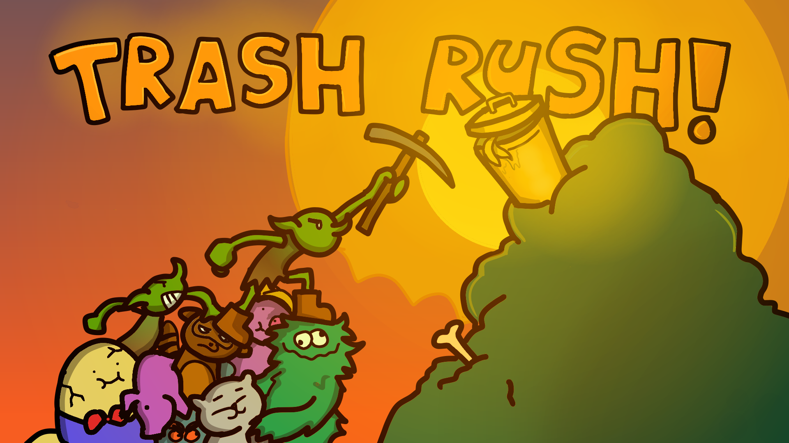

# 🗑️ TrashRush

*TrashRush* is a fast-paced tapping game built for the *Gorbagana* chain — a blazing fast Solana-based experimental testnet chain designed for on-chain multiplayer games.

  

🎮 Gameplay Overview

Click on trash as fast as you can to earn points and defeat your opponents!  
Choose powerups and compete over *3 intense rounds* — the player with the highest total score wins!

- 🧹 *Tap trash to earn points*
- 💀 *Trendy roguelike game design*
- ⚡ *Select powerups strategically*
- 🕹️ *Play in singleplayer or multiplayer mode*

---

🧪 Development Status

- ✅ Singleplayer mode works for local testing
- 🧪 Multiplayer mode is in *active development* (early bugs expected!)
- 🛠️ Backend server built using *Node.js*
- 🎨 Frontend made with *Phaser 3* (JavaScript)

---

  

🌐 Built For Gorbagana Chain

This game is powered by the *Gorbagana* chain (g-o-r-b-a-g-a-n-a), showcasing instant finality and zero-MEV performance.

---

📦 Tech Stack

- *Frontend:* Phaser 3
- *Backend:* Node.js
- *Blockchain:* Solana (Gorbagana testnet)

---

🚀 How to Play

1. Clone the repo
2. Run the index.html
3. Click trash, choose powerups, dominate 3 rounds! 

⭐ Future plans for development
- Setup different game modes for staking, as well as refund transactions
- Fix bugs and improve game stability
- Enhance Multiplayer mode 
- Expand the game to include more power-ups and game modes
- Enable sharing in socials

💬 Feedback & Contributions

Pull requests, issues, and feedback welcome!  
Let us know if you'd like to contribute or test multiplayer features.
Whatsapp 09123442142
Email gunroarcannon@gmail.com
Telegram/X @therealgunroar

---

⚠️ Disclaimer

Multiplayer is experimental — expect bugs and chaos. You’ve been warned. 😉

---

Made with 💚 for the Gorbagana Game Bounty.

